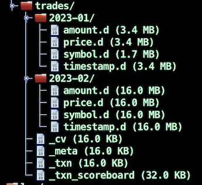

# Java de alto rendimiento: cuando las librerías estándar tardan demasiados nanosegundos

## De donde sale el proyecto? 

[QuestDB](https://github.com/questdb/questdb) nacio como proyecto personal de Vlad Ilyushchenko
en 2012, en el contexto de tener que analizar **series temporales** con una base de datos relacional 
no especializada. La historia completa, contada por el mismo, esta 
[aqui](https://news.ycombinator.com/item?id=23975807). Hay mas estrellas implicadas, leed la historia,
os puede servir de modelo para vuestras ideas mas absurdamente ambiciosas. 

(Tengo teclado ingles britanico, sin acentos, siento las molestias :)

Este tipo de datos es generado de continuo, en gran cantidad, y mientras esto ocurre, la 
base de datos tiene que dar respuesta rapida a las herramientas que usan estos datos, sin 
detener la ingesta y devolviendo resultados de forma interactiva, en pseudo tiempo real.

Como resultado de la frustracion con las soluciones existentes, en 2018 decidimos entrar en 
produccion con nuestro proyecto, y en 2019 creamos la [empresa](https://questdb.io/), porque 
vimos la oportunidad en el mercado. Immediatamente logramos la confianza de 
[Y-Combinator](https://www.ycombinator.com/), lo que facilito capital, contactos, y ayuda con 
la transicion de ser simplemente programadores, a ser empresarios con un term sheet.
A partir de ahi nuestra plantilla crecio, enseguida llego la serie A, que resulto en una 
muy buena posicion para nosotros. En la actualidad hemos crecido hasta ser 20, vamos rumbo 
de ser 25, acabamos de hacer la entrega de la version 
[7.0.1](https://github.com/questdb/questdb/releases/tag/7.0.1/) 
y pronto anunciaremos disponibilidad general del servicio en nuestra plataforma en la 
[nube](https://questdb.io/cloud/). La intencion es de monetizar el servicio para que la 
empresa perdure en el tiempo y el producto se convierta en el estandard de-facto, mientras 
mantenemos [QuestDB](https://github.com/questdb/questdb/) con codigo abierto, libre, para
beneficio de la comunidad **Open Source**, y de la `humanidad` en general. Podeis 
[CONTRIBUIR AQUI](https://github.com/questdb/questdb/blob/master/CONTRIBUTING.md/) y ganaros 
la camiseta, Javier y yo os guiaremos por el camino, sera divertido, aprenderemos todos. Pero 
cuidado, que es un pozo muy profundo.


## Ejemplo de SQL

Tabla completamente aleatoria generada con datos de ordenes de compra/venta de acciones
de un mercado financiero sin especificar:

```sql
CREATE TABLE trades AS (
    SELECT
        rnd_symbol('EURO', 'USD', 'OTHER') symbol,
        rnd_double() * 50.0 price,
        rnd_double() * 20.0 amount,
        to_timestamp('2023-01-01', 'yyyy-MM-dd') + x * 60 * 100000 timestamp
    FROM long_sequence(500000)
), INDEX(symbol capacity 128) TIMESTAMP(timestamp) PARTITION BY MONTH;
```

Esta tabla tiene una columna `TIMESTAMP` (se puede llamar como quieras), que es la **designada** 
para indexar los datos en el tiempo. Puede haber mas columnas del tipo `TIMESTAMP`, pero solo una
es la designada. Ojo que no es clave primaria, puede haber multiples filas con el mismo timestamp y
diferentes valores para las respectivas columnas. Esto senyalaria un fallo de un sensor. En este caso
las filas estan ordenadas por orden de insercion. Ademas,la tabla esta particionada en unidades de 
un mes. Soportamos granularidades diversas, `hora`, `dia`, `semana`, `mes`, `anyo`. Si vamos al sistema 
de ficheros podemos comprobar que hay `N` (aleatorio) nuevas carpetas, cada una conteniendo los 
ficheros correspondinentes a las columnas de la tabla, para una particion concreta:



Esta seria una consulta valida:

```sql
SELECT * FROM trades
WHERE symbol='EURO' AND 
      price > 49.99 AND 
      amount > 15.0 AND 
      timestamp BETWEEN '2022-12' AND '2023-02'
;
```

Por lo general, los datos del final de la tabla (mas recientes) son mas valiosos. Las particiones 
nos permiten desechar aquellas que no son de interes, o son antiguas, asi como acceder a los datos 
directamente sin necesidad de escanear toda la tabla.

## Por que Java?

En la city de Londres, que es de donde venimos todos, mas o menos, `Java` y `C++` son lenguages estandard, 
son lingua franca. Son fundacionales en el sector financiero. Ambos son usados para programar aplicaciones 
especializadas, pero quiza C++ se reserva para cuando realmente hay que sacar velocidad del hardware, porque 
es mas afin a este. Imaginemos un caso de uso tipico de la city.

En un mercado libre, los clientes de la entidad financiera **W** estaran mas inclinados a efectuar sus 
transacciones en los mercados financieros usando a `W` como intermediario, frente a **A**, cuando los precios
de `W`, frente a los de `A`, estan a favor del cliente (le cuesta dinero a `W`). Entonces, la estrategia 
a seguir por `W` es calcular sus modelos de precios de manera precisa, de forma que en el total
de transacciones al final del dia, `W` realiza mas a su favor, en un ciclo de optimizacion de lo que llaman 
**PNL**, Profits aNd Loses. Una reduccion del PNL del 10-15%, puede facilmente significar 10-15M por anyo a favor 
de `W`. Entonces, una `FinTech` compra lineas privadas, dedicadas, con los mercados financieros, y las fusionan
en un unico feed normalizado que es dado a sus clientes, por ejemplo `W`. En el lado del cliente, `W`, una 
aplicacion escrita en C++ expone una interfaz JNI para abrir este feed a las aplicaciones escritas en Java. 
La clave esta en recibir los datos de los mercados lo mas rapido posible, para procesarlos lo mas eficientemente posible, 
persistencia incluida, en base a reglas en funcion del mercado y del cliente, para poder servir las transacciones entre 
todos los participantes en un contexto que premia la velocidad.

Java, por otro lado, parece mas "estructurado/disciplinado" a la hora de programar, sus herramientas son muy 
buenas, es un lenguage maduro en continua evolucion, hay soluciones documentadas para todo, es robusto, confiable,
claro, especifico, te permite escribir un sistema grande y mantenerlo.

Java puede ser muy rapido, ya que te deja gestionar la memoria con llamadas de bajo nivel, de
forma que podemos tener estructuras de datos fuera del heap, y podemos pasar un puntero a las mismas
tanto en Java, como en C++, sin necesidad de copias, cruzando la linea a traves de JNI. La delegacion
entre Java y C++ es como 7 ns.

Las tecnicas empleadas en el sector financiero, High-throughput, Low-latency, son la base de `QuestDB`.

## Arquitectura


Lo que se ve, dividida en tres partes logicas:

- La parte que le da acceso a traves de la red, mediante los protocolos `PGWire`, `ILP` y `HTTP`.  
  En el [repositorio](https://github.com/questdb/questdb) esta dentro del modulo **core**, en el paquete **cutlass**. 
- El motor SQL, paquete **griffin**.
- El motor de acceso al sistema de ficheros, paquete **cairo**.

### Storage Engine

La idea es que nuestros datos en disco tienen la misma representacion que en memoria. Dado un array creado en
C++ y guardado en disco, tendra la misma forma y representacion cuando es accedido desde Java. Evitamos cambio
de representacion y conversiones, y todos los datos relacionados estan juntos y alineados con el hardware. 
Usamos las estructuras de datos correctas para el problema que estamos resolviendo y las implementamos para 
que su formato en memoria sea igual que en disco. Sabemos todos los secretos a bajo nivel gracias a nuestro
oscuro pasado en la city. Cada particion esta en su directorio, y en este se encuentra los 
ficheros de las columnas. Es una base de datos columnar, pero se accede de una forma similar a una base de datos 
relacional. Los ficheros de columnas estan ordenados de acuerdo con la columna designada como timestamp, con 
lo que acceder a una partition es immediato, y una vez dentro de la misma podemos emplear busqueda binaria y 
escaneos de arriba abajo, o alreves. Tener particiones nos ayuda a tener un tamanyo de ingestion constante 
cuando ocurre 24/7 y nos permite gestionar el espacio en disco.

Las columnas son de tipo fijo, o de tipo variable. Si son de tipo fijo, cada valor es de un ancho especifico 
dentro de un fichero (.d). Si son de tipo variable entonces hay dos ficheros, el de indices (.i) y el 
de datos (.d). En el de indices apuntamos la direccion, u offset, donde empieza el dato en el fichero de datos, 
mientras que en el fichero de datos anotamos la longitud, seguida por los bytes que componen el dato, lo cual 
sirve para reducir scaneos en disco. Tambien existe el tipo diccionario (simbolo) que es similar a un varchar,
pero ademas actua como conjunto, ya que una columna de este tipo no puede tener valores repetidos. Cada valor 
recibe un identificador unico (un entero) y usamos este en lugar de la cadena de caracteres al filtrar, lo que 
acelera el proceso enormemente. Son una suerte de indices accidentales que tienen una representacion textual y, 
naturalmente, hay un fichero que contiene la relacion entre esta y el identificador.

Al hacer una insercion de una, o varias filas, puede que sus "timestamps" esten ordenados y sean mayores que 
el ultimo que hay en la tabla. Esto es lo normal, este "path" esta optimizado. Pero puede que las filas lleguen 
fuera de orden y/o, lo peor, que sean anteriores al ultimo timestamp que hay en la tabla. Para solucionar esto, 
existe una zona de memoria donde se hace el ordenando de las filas mientras van llegando, hasta el momento del 
"commit". En ese momento todas las filas son guardadas en el disco, ordenadas en el tiempo marcado por la columna 
designada como la de timestamp. En caso de que exista filas pertenecientes a particiones que no estan cargadas 
en memoria, se abre la particion, es decir se mapean los ficheros de las columnas pertinentes, y se activa varias 
tareas concurrentes por columna, para insertar las filas donde toque, de manera que todo este ordenado en el 
tiempo, a la vez que corelacionado por offset. Penalizamos las escrituras, optimizamos las lecturas. Aun asi 
tenemos la capacidad de ser una estrella de neutrones, en el sentido gravitativo, 
e ingerir filas a razon de
[~4 Miles de Millones por segundo](https://questdb.io/blog/2022/05/26/query-benchmark-questdb-versus-clickhouse-timescale/), 
para cardinalidades (numero de columnas) altas.

Separamos la logica de acceso de lectura de la de escritura y las coordinamos por medio de memoria compartida
con acceso atomico. Los escritores versionan los directorios de las particiones usando un numero de transaccion 
a la hora de modificarlas. Cuando el commit ocurre, la nueva version es registrada en el fichero de metadatos 
`_txn`. Los lectores consultan este fichero para saber que hay disponible en disco. Tambien tienen acceso a las 
filas que estan en la memoria reservada para el commit, por tanto aun no en disco, para aquellas que pertenezcan 
a la ultima particion, es decir, si no hay `O3`, Out Of Order. Todos nuestros ficheros son memoria compartida 
por el pool de threads que ejecuta todas las tareas del sistema. Algunas de estas threads se encargan de borrar 
particiones cuya version sea menor que la que se indica en `_txt` y para las que no hay lectores. Otro fichero 
de metadatos, llamado transaction `score-board`, mantiene los numeros de version _txn de las transacciones en 
vuelo (para las que hay al menos un lector).

Esta capa logica da suficientes primitivas como para que la capa de computacion quede desacoplada del 
almacenamiento. Mas informacion aqui <https://questdb.io/docs/concept/storage-model/>.


### Compute Engine

Esta capa simplemente toma las entradas, el SQL, y lo hace cruzar un "pipeline" hecho a base de operadores.
Los operadores son componentes reutilizables que realizan transformaciones de datos por medio de llamadas a 
funciones, que pueden actuar como predicados, o transformar los datos. La computacion viene definida por el 
function call stack. Dependiendo de la maquina donde corramos, el optimizador generara filtros nativos, 
tambien reutilizables, que son [compilados](https://questdb.io/docs/concept/jit-compiler/) y guardados en 
la cache JIT cuando decide que es relevante. El optimizador esta basado en reglas, cuyo objetivo es tener 
un tiempo de ejecucion predecible, y evitar leer datos no necesarios. Por ejemplo:

```sql
SELECT * FROM trades
WHERE price > 0.1 AND time IN '2023-02-13T15';
```

Esta consulta llega a `QuestDB` por algun canal de la capa logica de acceso a la red y su representacion
en UTF-8 binario esta en un buffer del sistema operativo. Un operador recibe el puntero al inicio de este 
buffer y la instruccion de arrancar la compilacion del SQL. 
En ningun momento generaremos objetos. No hay Strings per-se en nuestro repositorio. Los Strings son en realidad 
instancias de [CharSequence](https://docs.oracle.com/javase/8/docs/api/java/lang/CharSequence.html), una 
abstraccion mayor sobre la cual nosotros podemos montar `flyweights` y emitirlos como tokens del analizador lexico. 
El analizador sintactico producira un modelo (un POJO) que contiene todo lo necesario para que el optimizador 
produzca un plan de ejecucion perfecto, puro como el agua de un manantial. En el ejemplo, si tenemos `N` partitiones, 
nuestro plan decide que N-1 no son consideradas, y la que queda es accedida mediante busqueda binaria
vectorizada, acotando una porcion definida de la particion, ordenada en el tiempo. De un paso hemos encontrado 
la zona temporal dentro de toda la base de datos, sea del tamanyo que sea, y solo falta aplicar un filtro. Dependiendo 
de nuestra maquina, de su arquitectura, en el mejor caso este filtro sera codigo maquina nativo usando `SIMD` y 
ejecutado por multiples threads para encontrar las filas que cumplen con el predicado. El del ejemplo es simple,
pero damos soporte a complejidad arbitraria, siempre que se trate de expresiones aritmeticas, o de comparacion, 
unidas mediante el operador logico `AND` y con algunas restricciones segun el tipo de la columna. Los registros 
ganadores son emitidos, organizados en filas, recordemos que nuestro almacenamiento es columnar, y enviados de 
vuelta al cliente a traves del canal por el que llego la consulta, usando el protocolo de comunicacion correspondiente.

## Este repositorio

Contiene dos ejemplos ejecutando `QuestDB` en el mismo proceso. Siguen el mismo guion:

1. Configurar el [entorno](https://questdb.io/docs/concept/root-directory-structure/) de ejecucion de `QuestDB`.
2. Arrancar el servidor.
3. Ejecutar una query que crea una tabla llena de datos aleatorios.
4. Ejecutar una query de seleccion, con filtros.
5. Mostrar los resultados de la query.

La diferencia esta en que:

- `SameProcessThroughPgWire`: Se conecta mediante un JDBC driver para Postgres.
- `SameProcessThroughCompiler`: Directamente compila, ejecuta y accede al resultado.

## Conclusion

Muchas gracias por atender el evento organizado por [MadridJUG](https://www.meetup.com/es-ES/madridjug/) y por 
ser un excelente auditorio. Muchas gracias a los organizadores, un aplauso de esos de reventar el teatro, por la
impecable ejecucion.

Estemos en contacto, el mejor medio es sin duda [Slack](https://slack.questdb.io/).

Aqui el enlace al encuentro en **YouTube** <https://www.youtube.com/watch?v=iyZYBstAP7Y>.
Aqui el enlace a la documentacion <https://questdb.io/docs/>.
Aqui el enlace al "swag" <https://questdb.io/community/>.
